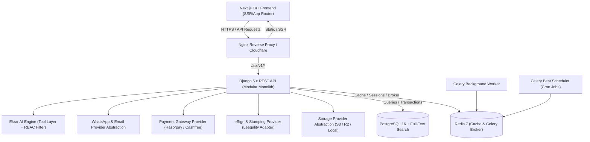
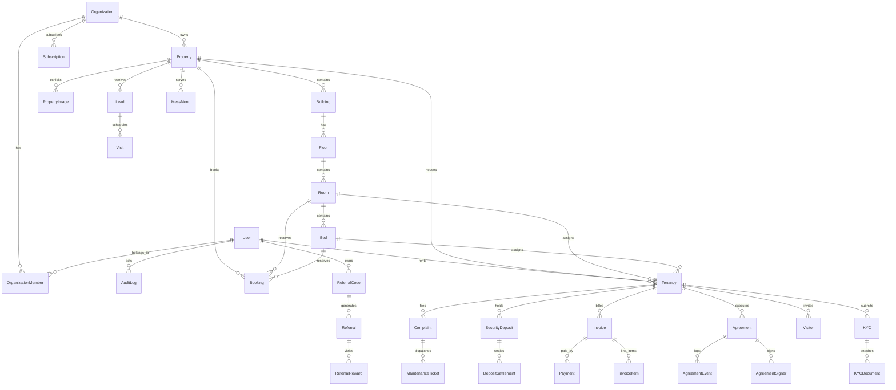
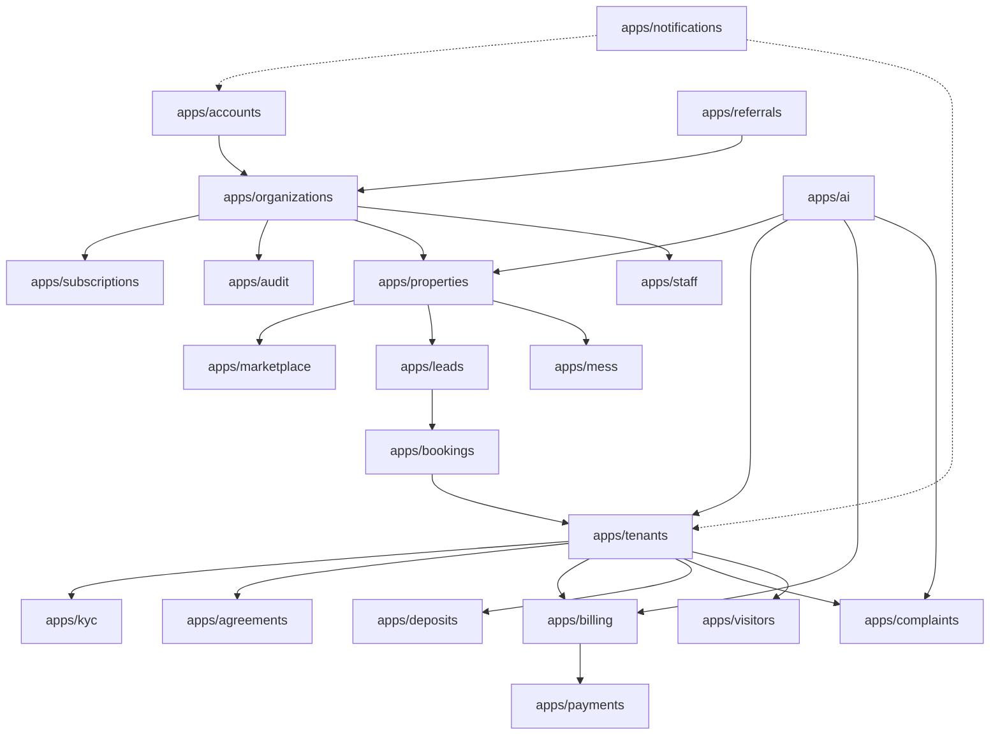

# eRentKarar — Master Architectural Blueprint & System Specifications

**Domain:** [https://erentkarar.com](https://erentkarar.com)  
**System:** India Rental Property Management + Marketplace + PG/Hostel/Co-Living SaaS  
**Version:** 1.0.0 (Production Blueprint)

---

## Table of Contents
1. [Executive Architecture Overview](#1-executive-architecture-overview)
2. [A. Current Architecture Report](#2-a-current-architecture-report)
3. [B. Recommended Modular Monolith Architecture](#3-b-recommended-modular-monolith-architecture)
4. [C. Database ERD & Entity Relational Schema](#4-c-database-erd--entity-relational-schema)
5. [D. Module Dependency Map](#5-d-module-dependency-map)
6. [E. REST API Map (v1 Specification)](#6-e-rest-api-map-v1-specification)
7. [F. Frontend Route Map & User Journeys](#7-f-frontend-route-map--user-journeys)
8. [G. Role-Based Access Control (RBAC) & Permission Matrix](#8-g-role-based-access-control-rbac--permission-matrix)
9. [H. MVP Implementation Roadmap](#9-h-mvp-implementation-roadmap)
10. [I. Security, Data Privacy & India Compliance Plan](#10-i-security-data-privacy--india-compliance-plan)
11. [J. Deployment, Container & Production Architecture](#11-j-deployment-container--production-architecture)

---

## 1. Executive Architecture Overview
eRentKarar is designed as India's premier digital rental operating system, unifying the fragmented landlord, tenant, PG/hostel operator, and rental marketplace ecosystem into a cohesive, high-performance SaaS platform.

### Core Tenets:
- **India-First Compliance**: State-specific stamp duty models, rental agreement generation, Aadhaar/PAN KYC workflows, GST-ready invoicing, UPI/Razorpay payment automation, and WhatsApp transactional pipelines.
- **Strict Multi-Tenant Isolation**: Complete row-level and object-level scoping by `organization_id` to eliminate Insecure Direct Object References (IDOR).
- **Concurrency & Double-Booking Protection**: Strict database transactions and pessimistic/optimistic inventory locking for rooms and beds.
- **Provider-Agnostic Abstraction Layer**: Pluggable adapters for Storage (S3 / Cloudflare R2 / Local), eSign & Stamping (Leegality / Sandbox / Signzy), Payments (Razorpay / Cashfree / Mock), and Communication (WhatsApp Cloud API / Gupshup / Twilio, SendGrid / SMTP).
- **Ekrar AI Assistant**: Read-only business analytics tool layer with strict role permissions, confirmation-gated sensitive actions, and immutable audit logs.

---

## 2. A. Current Architecture Report
- **Workspace State**: Fresh workspace initialized at `c:\Users\gauta\OneDrive\Desktop\erentkarar`.
- **Host Runtime**: Python 3.13.5, Node.js v24.18.0, npm 11.16.0, Git.
- **Evaluation**: Green-field implementation with zero legacy baggage. Allows clean, pristine scaffolding of the modular backend (Django 5.x / DRF) and modern frontend (Next.js 14/15 App Router, TypeScript, Tailwind CSS, shadcn-inspired components).

---

## 3. B. Recommended Modular Monolith Architecture

### High-Level Topology


### Backend Directory Layout (`/backend`)
```
backend/
├── manage.py
├── erentkarar/
│   ├── __init__.py
│   ├── asgi.py
│   ├── wsgi.py
│   ├── urls.py
│   ├── settings/
│   │   ├── base.py
│   │   ├── local.py
│   │   └── production.py
│   └── celery.py
├── apps/
│   ├── accounts/          # Custom User, Auth, OTP, Profile, Staff
│   ├── organizations/     # Multi-tenant Organization, Member, Invites
│   ├── properties/        # Property, Building, Floor, Room, Bed, Amenities, Photos
│   ├── marketplace/       # Public search, filters, SEO listings, favorites
│   ├── tenants/           # Tenancy, Move-in, Move-out, KYC links
│   ├── leads/             # CRM Leads, Visits, Follow-up Reminders
│   ├── bookings/          # Room/Bed Booking engine, Token payment, Lock
│   ├── kyc/               # KYC Docs, Verification pipeline, Masked URLs
│   ├── agreements/        # Templates, State Stamp Duty Rules, eSign, PDF Engine
│   ├── billing/           # Invoices, Rent, Utilities, Late Fees, Receipts
│   ├── payments/          # Payment transactions, Webhooks, Idempotency
│   ├── deposits/          # Security Deposit Ledger, Deductions, Settlements
│   ├── complaints/        # Tenant complaints, Maintenance tickets, Vendor cost
│   ├── visitors/          # Digital Visitor log, OTP check-in, Host approval
│   ├── mess/              # Mess plans, Daily Menu, Attendance, Meal billing
│   ├── staff/             # Staff assignments, Shifts, Permissions
│   ├── notifications/     # In-app, Email, WhatsApp dispatch & logs
│   ├── reports/           # Financial P&L, Occupancy, Collections, CSV/PDF
│   ├── referrals/         # Referral codes, Conversions, Ledgers, Payouts
│   ├── subscriptions/     # SaaS tiers (Free, Starter, Pro, Business)
│   ├── ai/                # Ekrar AI Assistant, Safe Tools, Action Confirmation
│   └── audit/             # Immutable Audit Log for all security events
```

---

## 4. C. Database ERD & Entity Relational Schema

### Entity Relationship Diagram


---

## 5. D. Module Dependency Map



---

## 6. E. REST API Map (v1 Specification)

All API endpoints follow the consistent REST contract:
```json
{
  "success": true,
  "data": {},
  "message": "Operation successful",
  "meta": { "page": 1, "total": 100 }
}
```

### Key Endpoint Groups:
1. **Authentication & Identity (`/api/v1/auth/`)**
   - `POST /register/` - Register owner/tenant with email/phone
   - `POST /login/` - Login & obtain JWT pair
   - `POST /refresh/` - Token refresh
   - `POST /otp/send/` & `POST /otp/verify/` - Indian mobile OTP flow
   - `GET /me/` - Current user profile & active organizations
2. **Organizations (`/api/v1/organizations/`)**
   - `GET /`, `POST /` - List/Create rental business organization
   - `GET /:id/members/` - Manage staff and property managers
3. **Properties & Units (`/api/v1/properties/`)**
   - `GET /`, `POST /` - Scoped properties list/create
   - `GET /:id/`, `PUT /:id/`, `DELETE /:id/` - Property CRUD
   - `POST /:id/buildings/`, `POST /buildings/:id/floors/` - Hierarchy creation
   - `POST /floors/:id/rooms/`, `POST /rooms/:id/beds/` - Room/Bed inventory
   - `POST /:id/publish/` - Publish to public marketplace
4. **Public Marketplace (`/api/v1/marketplace/`)**
   - `GET /search/` - Filter by city, budget, gender, amenities, PG/flat/hostel
   - `GET /property/:slug/` - Detailed SEO-ready property data
   - `POST /enquire/` - Public enquiry submission (creates CRM lead)
5. **Leads & Visits CRM (`/api/v1/leads/`)**
   - `GET /`, `POST /` - Owner CRM lead management
   - `POST /:id/schedule-visit/` - Schedule tenant site visit
   - `POST /visits/:id/status/` - Approve, reschedule, complete visit
6. **Bookings Engine (`/api/v1/bookings/`)**
   - `POST /create/` - Atomically lock bed/room and create pending booking
   - `POST /:id/confirm/` - Confirm after token payment
7. **KYC Verification (`/api/v1/kyc/`)**
   - `POST /upload/` - Upload Aadhaar/PAN/Passport documents with MIME validation
   - `GET /:id/status/` - Track verification status
   - `POST /:id/verify/` - Owner/Admin manual or automated verification
8. **Rental Agreements (`/api/v1/agreements/`)**
   - `GET /state-rules/` - Indian state stamp duty & fee calculation
   - `POST /generate/` - Generate legal agreement draft from tenancy data
   - `POST /:id/send-esign/` - Dispatch Leegality/eSign invitation
   - `POST /webhook/leegality/` - Idempotent eSign webhook processor
9. **Billing & Invoicing (`/api/v1/invoices/`)**
   - `GET /`, `POST /` - Monthly rent + utility + mess invoice generator
   - `GET /:id/receipt/` - Download PDF tax receipt
10. **Payments (`/api/v1/payments/`)**
    - `POST /create-order/` - Initiate Razorpay/Cashfree order
    - `POST /webhook/` - Verified server-side webhook handler
11. **Complaints & Maintenance (`/api/v1/complaints/`)**
    - `POST /` - Tenant files complaint with media attachment
    - `POST /:id/assign/` - Assign maintenance staff
    - `POST /:id/resolve/` - Mark resolved with tenant confirmation
12. **Ekrar AI Assistant (`/api/v1/ai/`)**
    - `POST /chat/` - Natural language query (Hindi/English)
    - `POST /action/preview/` - Safe action preview (e.g. rent reminders)
    - `POST /action/confirm/` - User-confirmed action execution with audit log

---

## 7. F. Frontend Route Map & User Journeys

```
/                                -> Public Landing Page (Hero, Value Prop, City Discovery)
/properties                      -> Marketplace Search & Filtering (Map + Cards)
/properties/[slug]               -> Detailed Listing (Photos, Room selector, Amenities, Schedule Visit)
/pg, /hostels, /flats, /coliving -> Curated category portals
/cities/[city]                   -> Programmatic SEO City Landing Pages
/pricing                         -> Transparent SaaS Tiers & Calculator
/login, /register, /forgot-pwd   -> Multi-role Auth Pages

/dashboard                       -> Owner Overview (Occupancy, Rent dues, Leads, Quick Actions)
/dashboard/properties            -> Property & Unit Hierarchy Tree
/dashboard/tenants               -> Active Tenancies, Onboarding & KYC Tracker
/dashboard/leads                 -> CRM Pipeline (New, Visited, Negotiating, Converted)
/dashboard/agreements            -> Agreement Generator, Stamping & eSign Dispatcher
/dashboard/invoices              -> Billing Engine, Electricity readings, Rent roll
/dashboard/complaints            -> Maintenance Ticket Kanban & Vendor Assignment
/dashboard/mess                  -> Daily Menu, Attendance & Meal Billing
/dashboard/visitors              -> Digital Guard Log & Security Approval
/dashboard/referrals             -> Referral Earnings, Codes & Organization tracker
/dashboard/reports               -> Financial P&L, Occupancy & CSV Export
/dashboard/ai                    -> Ekrar AI Dedicated Command Center

/tenant                          -> Tenant Stay Overview (Current bed, dues, announcements)
/tenant/rent                     -> Monthly Invoices & 1-Click UPI Payment
/tenant/agreement                -> View & eSign Rental Agreement
/tenant/kyc                      -> Secure Document Upload & Status
/tenant/complaints               -> Raise maintenance tickets with photo uploads
/tenant/visitors                 -> Issue visitor passes with QR/PIN

/admin                           -> Super-Admin Governance (Organizations, Risk flags, Health)
```

---

## 8. G. Role-Based Access Control (RBAC) & Permission Matrix

| Role | Properties | Tenancy & KYC | Billing & Invoices | Agreements | Complaints | Mess/Visitors | System Admin |
|---|---|---|---|---|---|---|---|
| **SUPER_ADMIN** | View All | View All | View All | View All | View All | View All | Full Access |
| **OWNER / ADMIN** | Full CRUD | Full CRUD | Full CRUD | Generate/Sign | Full CRUD | Full CRUD | Org Scoped |
| **PROPERTY_MANAGER** | View/Update | Onboard/KYC | View/Collect | Send for Sign | Assign/Resolve | Manage | None |
| **ACCOUNTANT** | View | View | Full CRUD | View | None | View Bills | None |
| **MAINTENANCE_STAFF** | View units | None | View costs | None | Update status | None | None |
| **TENANT** | View Stay | Own Stay | Pay/Download | Review/Sign | Create/Confirm | Invite/Meal opt | None |

---

## 9. H. MVP Implementation Roadmap

- **Phase 0: Architecture, ERD, Schema & Scaffolding** (Completed below)
- **Phase 1: Backend Scaffolding & Core Models** (Custom User, Org, Properties, Hierarchy, Marketplace, Auth)
- **Phase 2: Tenant Lifecycle, CRM, Booking & KYC** (Lead pipeline, double-booking safe engine, encrypted KYC storage)
- **Phase 3: India Agreements, Stamp Duty Engine & eSign Adapter** (State rules, PDF generation, Leegality/mock provider)
- **Phase 4: Rent Billing, Utility Metering & Payment Engine** (Invoice generation, Razorpay/mock integration, Webhooks)
- **Phase 5: Operations & Complaints** (Maintenance tickets, Mess, Visitor security logs, Communication logs)
- **Phase 6: Ekrar AI Assistant & Referral Engine** (Read-only tool calling, action confirmation, anti-fraud referral tracking)
- **Phase 7: Frontend Application** (Next.js 14 App Router, responsive modern UI, Owner & Tenant portals, Marketplace)
- **Phase 8: End-to-End Validation & Acceptance Tests** (Full user journey verification).

---

## 10. I. Security, Data Privacy & India Compliance Plan

1. **No IDOR (Insecure Direct Object Reference)**: Every database query verifies `organization_id` matching the authenticated user's active membership.
2. **KYC & Document Isolation**: KYC files are stored with server-generated UUID filenames in private buckets. Accessible only via short-lived signed URLs (15-minute TTL).
3. **Double-Booking Prevention**: Database transactions utilize `select_for_update()` on `Room` and `Bed` entities to guarantee zero inventory race conditions.
4. **Financial Immutability**: Billing ledgers use append-only adjustments and credit notes instead of destructive overwrites.
5. **Prompt Injection Guard**: Ekrar AI tools operate strictly on sanitized inputs; queries execute predefined safe Python methods, never direct dynamic SQL.

---

## 11. J. Deployment, Container & Production Architecture
- **Docker & Docker Compose**: Independent services for `web` (Django), `frontend` (Next.js), `db` (Postgres 16), `redis` (Redis 7), `celery_worker`, and `celery_beat`.
- **Health Checks**: `/health/` and `/ready/` endpoints checking database connectivity and cache responsiveness.
- **Environment Management**: Strict `.env` parsing via `django-environ` with comprehensive `.env.example`.
