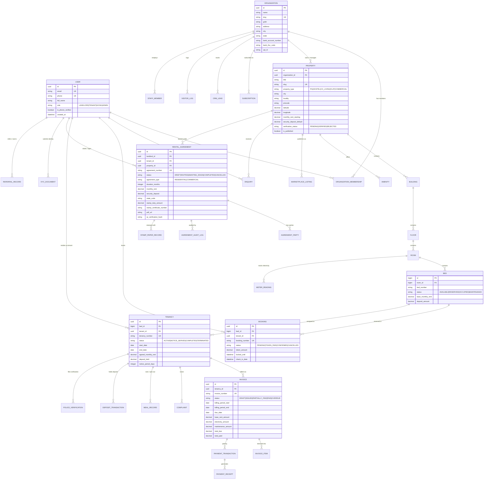

# 🗄️ Database Architecture & Entity Relationship Diagrams (ERD)

This document provides a comprehensive technical reference for the **eRentKarar** relational database architecture, entity relationships, schema constraints, indexing strategies, and transactional concurrency guarantees.

---

## 📐 High-Level Entity Relationship Diagram (Mermaid ERD)



---

## 🏛️ Domain Schemas & Detailed Models

### 1. Accounts & Authentication (`apps.accounts`)
- **`User` (Custom AbstractUser)**:
  - `id` (UUID, Primary Key)
  - `email` (EmailField, Unique, Indexed)
  - `phone` (CharField, Unique, Indexed, max 15)
  - `full_name` (CharField, max 255)
  - `role` (CharField, Choices: `OWNER`, `TENANT`, `STAFF`, `KIOSK`, `ADMIN`)
  - `avatar` (ImageField, nullable)
  - `is_phone_verified` (BooleanField, default False)
  - `preferred_language` (CharField, `en`, `gu`, `hi`)
- **`OTPVerification`**:
  - `phone` (CharField, Indexed)
  - `otp_code` (CharField, max 6, hashed)
  - `purpose` (CharField: `LOGIN`, `ESIGN`, `PASSWORD_RESET`)
  - `expires_at` (DateTimeField)
  - `is_used` (BooleanField)

### 2. Multi-Tenant Organizations (`apps.organizations`)
- **`Organization`**:
  - `id` (UUID, Primary Key)
  - `name` (CharField, max 255)
  - `slug` (SlugField, Unique)
  - `gstin` (CharField, nullable, max 15)
  - `pan_number` (CharField, nullable, max 10)
  - `upi_id` (CharField, nullable, e.g. `landlord@icici`)
  - `bank_name`, `bank_account_number`, `bank_ifsc_code`
  - `subscription_tier` (`STARTER`, `GROWTH`, `ENTERPRISE`)
- **`OrganizationMembership`**:
  - `user_id` (FK to User)
  - `organization_id` (FK to Organization)
  - `role` (`OWNER`, `PROPERTY_MANAGER`, `ACCOUNTANT`, `WARDEN`, `RECEPTIONIST`)
  - Unique constraint on `(user_id, organization_id)`

### 3. Property & Inventory Hierarchy (`apps.properties`)
```
Property (Complex/Building Group)
  └── Building (Tower A, Tower B)
        └── Floor (1st Floor, 2nd Floor)
              └── Room (Room 101 - 2-Sharing AC)
                    └── Bed (Bed A, Bed B - Unit of Occupancy)
```
- **`Property`**:
  - `id` (UUID, PK), `organization_id` (FK)
  - `title`, `slug`, `property_type` (`PG`, `HOSTEL`, `CO_LIVING`, `FLAT`, `COMMERCIAL`, `ROOM`)
  - `address`, `locality`, `city`, `state`, `pincode`
  - `latitude`, `longitude` (DecimalField, Indexed for spatial bounding box)
  - `monthly_rent_starting`, `security_deposit_default`, `notice_period_days`
  - `gender_preference` (`MALE`, `FEMALE`, `CO_ED`, `FAMILY`)
  - `food_included` (BooleanField), `rules_and_policies` (TextField)
  - `verification_status` (`PENDING`, `VERIFIED`, `REJECTED`)
  - `is_published` (BooleanField, default True)
- **`Room`**:
  - `id` (BigAutoField), `floor_id` (FK), `room_number` (CharField)
  - `occupancy_type` (`SINGLE`, `DOUBLE`, `TRIPLE`, `FOUR_SHARING`, `ENTIRE_FLAT`)
  - `has_attached_bathroom`, `has_balcony`, `is_air_conditioned`
  - `electricity_sub_meter_number` (CharField, nullable)
- **`Bed`**:
  - `id` (BigAutoField), `room_id` (FK)
  - `bed_number` (CharField, e.g. "Bed 1", "Left Window Bed")
  - `status` (`AVAILABLE`, `RESERVED`, `OCCUPIED`, `MAINTENANCE`)
  - `base_monthly_rent`, `deposit_amount`

### 4. Concurrency & Pessimistic Locking in Bookings (`apps.bookings`)
- **`Booking`**:
  - `id` (UUID, PK), `bed_id` (FK), `tenant_id` (FK)
  - `booking_number` (CharField, Unique, e.g. `ERK-BKG-2026-8812`)
  - `status` (`PENDING`, `TOKEN_PAID`, `CONFIRMED`, `CANCELLED`, `REFUNDED`)
  - `token_amount` (DecimalField, default ₹1,000)
  - `locked_until` (DateTimeField, 15-minute checkout window)
- **Atomic Locking Guarantee**:
  ```python
  with transaction.atomic():
      bed = Bed.objects.select_for_update().get(id=bed_id)
      if bed.status != "AVAILABLE":
          raise ValidationError("Bed is already reserved or occupied.")
      bed.status = "RESERVED"
      bed.save()
      booking = Booking.objects.create(...)
  ```

### 5. Invoicing & Sub-Meter Electricity Engine (`apps.billing`)
- **`MeterReading`**:
  - `room_id` (FK), `reading_date` (DateField)
  - `previous_units`, `current_units`, `consumed_units` (Generated/Computed)
  - `rate_per_unit` (DecimalField, e.g. ₹9.50/unit)
  - `total_amount` (Computed: `consumed_units * rate_per_unit`)
- **`Invoice`**:
  - `tenancy_id` (FK), `invoice_number` (Unique, e.g. `ERK-INV-2026-1049`)
  - `billing_period_start`, `billing_period_end`, `due_date`
  - `base_rent_amount`, `electricity_amount`, `maintenance_amount`, `discount_amount`
  - `total_due`, `total_paid`, `balance_remaining`
  - `status` (`DRAFT`, `ISSUED`, `PAID`, `PARTIALLY_PAID`, `OVERDUE`)

### 6. Digital Rental Agreements & Legal e-Stamping (`apps.agreements`)
- **`RentalAgreement`**:
  - `landlord_id` (FK), `tenant_id` (FK), `property_id` (FK)
  - `agreement_number` (Unique, e.g. `AGR-GJ-2026-9F3130`)
  - `agreement_type` (`RESIDENTIAL`, `COMMERCIAL`, `LEAVE_AND_LICENSE`)
  - `duration_months` (default 11)
  - `monthly_rent`, `security_deposit`, `escalation_percentage` (default 5%)
  - `state_code` (`GJ`, `MH`, `KA`, `DL`, `TN`, `TS`, `UP`)
  - `stamp_duty_amount` (Computed via state formula)
  - `stamp_certificate_number` (e.g. `IN-GJ89204189024X`)
  - `status` (`DRAFT`, `INVITED`, `AWAITING_ESIGN`, `COMPLETED`, `CANCELLED`)
  - `pdf_url` (File path to signed stamp deed)
  - `qr_verification_hash` (SHA-256 for public validation)

---

## ⚡ Database Performance & Indexing Strategy

1. **Composite B-Tree Indexes**:
   - `(city, property_type, is_published)` on `Property` for sub-10ms marketplace queries.
   - `(latitude, longitude)` on `Property` for radius and map viewport filtering.
   - `(organization_id, status)` on `Invoice` and `Tenancy` for owner dashboard metrics.
2. **Foreign Key Cascade Strategies**:
   - `Property ➔ Building ➔ Floor ➔ Room ➔ Bed`: `on_delete=models.CASCADE`
   - `Tenancy ➔ Invoice`: `on_delete=models.PROTECT` (prevents accidental deletion of tax records)
   - `Agreement ➔ User`: `on_delete=models.PROTECT` (maintains legal audit trail)
3. **Database Concurrency Isolation**:
   - Read Committed (PostgreSQL / SQLite) with atomic transaction wrapping on financial payments and bed check-ins.
